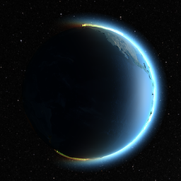

# MSBCR

By Andrew Farm  
[http://www.andrewofarm.com/](http://www.andrewofarm.com/)

## Introduction

MSBCR is a real-time 3D globe renderer. It is written in Java using
[LWJGL](http://lwjgl.org/).

## Features
  * Exaggerated terrain using displacement map and normal map
  * Shadows
  * Animated clouds and auroras using Perlin noise
  * Atmospheric Rayleigh scattering

## Gallery

(Note: the gif framerates are lower than that of the program)

## Navigation

  * Scroll to zoom.
  * Drag to rotate the camera around the globe.
  * Use arrow keys to change the camera angle.
  * Use + and - to speed up/slow down the passage of time.
  * Use esc to toggle between a heliostationary and geostationary viewpoint.
  * Use number keys to switch between rendering modes.
    * 1 - normal
    * 2 - HDR
    * 3 - experimental

## License

This work is published under the
[MIT liscense](https://choosealicense.com/licenses/mit/).

## Dependencies

MSBCR requires Java 8 and JDK 1.8.

MSBCR uses LWJGL 3.1.2 as a Java wrapper around OpenGL. The required LWJGL
binaries are included in this repository in the lwjgl/ directory.

If you for some strange reason choose instead to download LWJGL from
[lwjgl.org](http://lwjgl.org/), MSBCR uses these components:

  * LWJGL core
  * OpenGL bindings
  * stb bindings
  * JOML v1.9.3

## Installation

MSBCR has been tested on macOS Sierra 10.12.5 with a 1536MB Intel Iris 6100
GPU.

MSBCR can by run by running HelloWorld.java. First you must ensure the LWJGL
binaries are added to the classpath or as a user library. The way to do this
varies by IDE.

Whichever platform you build MSBCR on, you must add the following to the Java
VM arguments:

    -Dorg.lwjgl.librarypath=lwjgl

This specifies the location of the LWJGL binaries (the lwjgl/
directory).

When running from the command line, simply run the command with this argument.
In IntelliJ IDEA, the VM arguments can be edited under Run > Edit
Configurations.

### X Window System

On some platforms, GLFW uses the X Window System. If this is the case, you will
also need to add the following VM argument in order for GLFW to work properly:

    -XstartOnFirstThread

## Support

MSBCR has only been tested on macOS. If you encounter any problems building or
running MSBCR, please submit an issue detailing the problem.

## Issues

MSBCR currently has some known issues, including:

  * Incorrect viewport size on non-retina displays
  * Texture glitch along prime meridian
  * Visible T-junctions along the edges of globe tiles at different levels of detail
  * Decreased performance rendering the atmosphere when zoomed in
  * Dark spots along coastlines at low levels of detail
  * Subtle lighting artifacts and occasional shadow acne
